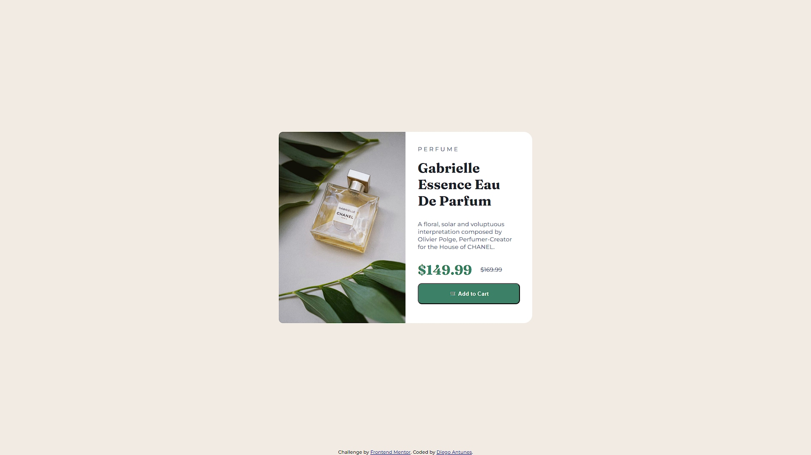

# Frontend Mentor - Product preview card component

- [Overview](#overview)
  - [The challenge](#the-challenge)
  - [Screenshot](#screenshot)
- [My process](#my-process)
  - [Built with](#built-with)
  - [What I learned](#what-i-learned)
- [Author](#author)

## Overview

My solution of the "Produt Preview Card Component" challenge.

### The challenge

Users should be able to:

- View the optimal layout depending on their device's screen size
- See hover and focus states for interactive elements

### Screenshot

## My process

Mobile-first

### Built with

- Semantic HTML5 markup
- CSS custom properties
- Flexbox
- VSCode Colorpicker extension

### What I learned

- CSS @media queries are very confusing

## Author

- Website - [Diego Antunes](https://dian-new-dev.github.io/Lista-de-Projetos/)
- Frontend Mentor - [@ydiannewdev](https://www.frontendmentor.io/profile/diannewdev)